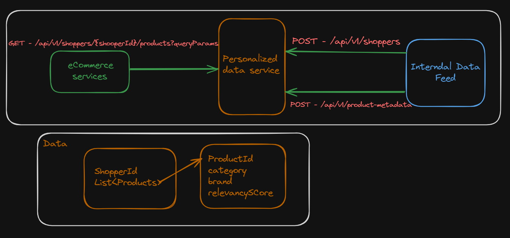
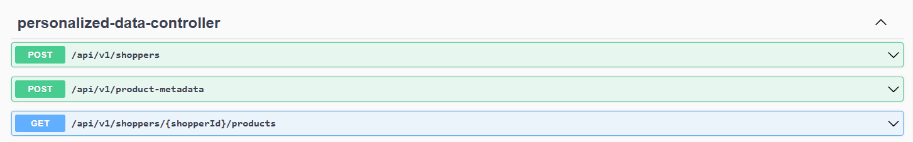
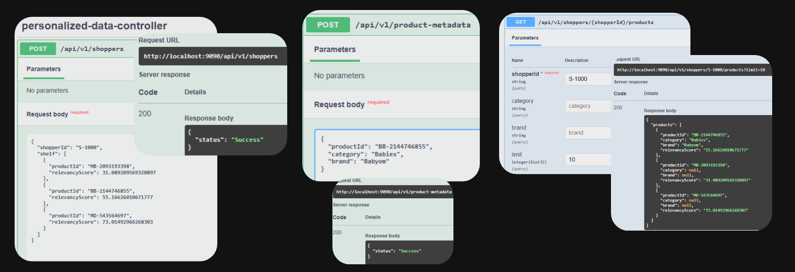

# niq-personalized-data-api

# About the App

This is Spring Boot based REST api app exposes 2 post end points and 1 get endpoints, database used postgres.

# Libraries used
1. Spring boot 3
2. Spring boot JPA - for Database operations.
3. Spring boot cache - to cache and improve performance by reducing db calls.
4. Swagger - for API documentation and test.
5. Junit for unit testing
6. Postgres 16 as database
7. Docker & Docker Compose for deployment
8. Java 22 version 

# Rest End points
Swagger url: http://localhost:9090/swagger-ui/index.html

1. External, to fetch products (GET)        : 
``http://localhost:9090/api/v1/shoppers/S-1000/products?category=testtest&brand=test&limit=10`` - returns list of products as JSON.
                                
2. Internal, to feed shopper data (POST)    : ``http://localhost:9090/api/v1/shoppers`` 
3. Internal, to feed product metadata (POST) : ``http://localhost:9090/api/v1/product-metadata``

# Deployment
App is dockerized with dockerFile and docker compose including postgres image. Hence app can be quickly deployed in any cloud.
App parameters are tokenized with environmental variables.

[app-builder.bat](app-builder.bat) - run this file to build the and and create docker image and push it to docker repository.

[app-starter.bat](app-starter.bat) - run this file to starts the app with postgres image (images will be pulled from docker hub if it's not available in local).

[app-stopper.bat](app-stopper.bat) - run this file to stop the app and postgres image.
